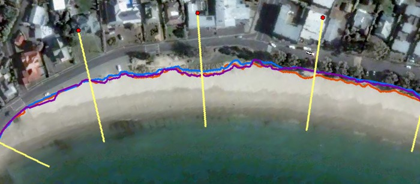
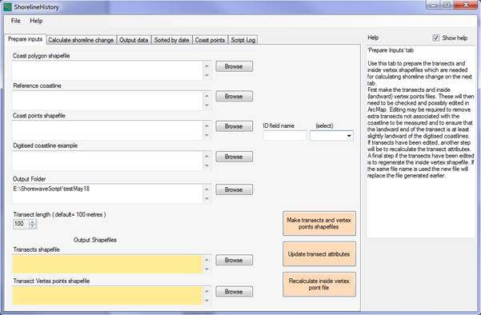
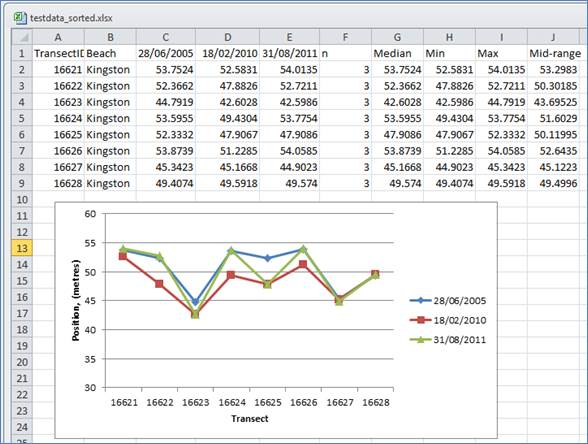

# ShorelineHistory 
ShorelineHistory is a tool for measuring coastline change. This tool measures change in shoreline position over time along a set of equally spaced coastal transects. The input shoreline positions are first digitised from aerial photos of the coast taken as snapshots at intervals over time. ShorelineHistory has a graphical user interface (GUI) for entering input parameters and to run the geoprocessing steps. At the core of the tool is a set of Python scripts for geoprocessing in ArcGIS. The tool produces tables of data showing the shoreline positions at transects and changes in position along transects. Users can then export the data for further analysis in Excel or other software. The ShorelineHistory GUI is a .NET application using .NET framework version 3.5. The shapefile format is used for all spatial data.

Shoreline History has a user interface for entry of parameters and to run the tools.

Outputs can be opened in Excel or other software.

ShorelineHistory Version 1 User Manual  is included as pdf and can also be viewed [as html](http://docs/ShorelineHistory_User_Manual_1_0.htm).
